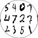

 

**scribble2digit** is a Python machine learning code that uses [TensorFlow](https://www.tensorflow.org/) and [Keras](https://keras.io/) to identify handwritten digits from a version of the MNIST dataset of [LeCun _et al._\(1998\)](http://yann.lecun.com/exdb/mnist/index.html) that was provided by the [Kaggle Digit Recognizer](https://www.kaggle.com/c/digit-recognizer) competition.

# Dataset description

See the [description](https://www.kaggle.com/c/digit-recognizer/data) provided by the Kaggle Digit Recognizer competition.

# Software framework
| Component | Version  |
| --------- | ---------|
| Python | 3.8 |
| TODO | TODO |

# Hardware framework

The project was executed on the following hardware:

| Component | Specifications  |
| --------- | --------------- |
| CPU       | Intel i7 4770   |
| GPU       | NVIDIA GTX 1080 |
| Memory    | 16GB ddr3       |

# Data download API

The code uses the [Kaggle API](https://github.com/Kaggle/kaggle-api) to download the external input data from [Kaggle](https://www.kaggle.com).  

A file _kaggle.json_, which contains user API credentials, should be copied to the _.kaggle_ directory, located in the user's _home_ directory.

For more information, see the [Kaggle API documentation](https://github.com/Kaggle/kaggle-api).

# Project author

[deepVector](https://github.com/deepVector)

# Licence

This project (excluding external input data) is licensed under the terms of the _Creative Commons Attribution 4.0 International Public License_ (cc-by-4.0; see _LICENSE.md_).

# Acknowledgements

The external input dataset used in this project was provided by the [Kaggle Digit Recognizer Competition](https://www.kaggle.com/c/digit-recognizer).
 
